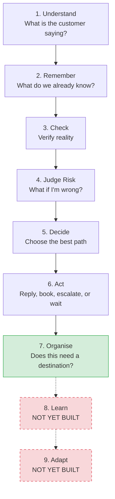
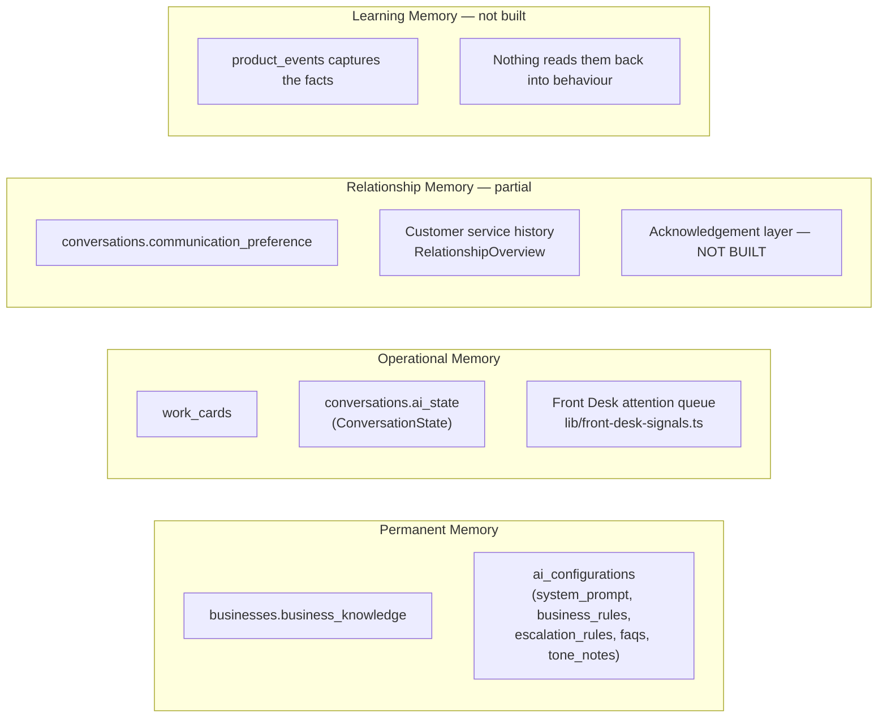

# 10 — ReplyFlow Brain Architecture

**How the Brain Loop and the Business Brain actually work, right now, and exactly where in the codebase each piece lives.** Companion to [09-Receptionist-Intelligence-Architecture.md](09-Receptionist-Intelligence-Architecture.md) (which covers the receptionist's real-time, turn-by-turn reasoning) — this document is the broader map: the full nine-stage decision loop the *ReplyFlow Founder Handbook* (`ReplyFlow Founder Handbook/Chapter 04 — The ReplyFlow Brain.rtf`) describes, and the memory model behind it (Handbook Chapter 05, *The Business Brain*).

**The Founder Handbook is the authority this document answers to.** Where this document and the handbook disagree, the handbook wins — this is a map of the *implementation*, not a redefinition of the *philosophy*. Written and kept current as of the Organise Checkpoint's implementation (2026-08-01), the first piece of engineering built directly from the handbook.

**A stale document worth naming so it doesn't confuse a future reader:** `DOCS/05_Shared_Brain_Architecture.md.rtf` (untracked, sitting in the repo root's `DOCS/` folder) describes an earlier "Seven Brains" concept (Memory / Reasoning / Learning / Planning / Communication / Business / Reflection). That vocabulary was already explicitly rejected during this codebase's own Sprint 6 migration — `lib/brain/types.ts`'s own docstring records the decision: *"the seven-Brains vocabulary Sprint 4B guessed... Sprint 6 explicitly forbids building architecture with no current consumer."* The real, current, implemented model is the one below — the Founder Handbook's ReplyFlow Brain / Business Brain split, not the seven-Brains draft.

---

## The Brain Loop

Nine stages, per Handbook Ch.4. Every real customer interaction passes through the first six every time; **Organise** is now a permanent seventh stage; **Learn** and **Adapt** are named, intentional gaps — not oversights, deferred to Phase 5 pending real pilot data (see `DOCS/SPECS/ReplyFlow-Master-Execution-Plan.md`).

### Stage-by-stage

| # | Stage | Handbook's own definition | Real implementation | Status |
|---|---|---|---|---|
| 1 | **Understand** | "What is the customer saying, what do they mean, what emotion is present." | `lib/reply-engine/understanding/classify.ts` — `classifyMessage()`. Structured-output LLM call; produces intent, confidence, safety tag, updated `ConversationState`. | Implemented |
| 2 | **Remember** | "What do we already know? Customer history, Work Cards, diary, business rules, owner preferences." | `lib/reply-engine/context/assemble.ts` — `assembleContext()`. Pulls business knowledge (`businesses.business_knowledge`), taught config (`ai_configurations`), customer memory, prior `ConversationState` (`conversations.ai_state`). | Implemented |
| 3 | **Check** | "Verify availability, hours, existing commitments — never assume." | Also inside `context/assemble.ts` (diary/availability check) and the `commitments` ledger already carried in `ConversationState` (`lib/reply-engine/understanding/state.ts`). | Implemented |
| 4 | **Judge Risk** | "What happens if I'm wrong? Consequence matters more than confidence." | `lib/reply-engine/safety/evaluate.ts` — `evaluateSafety()`. Fact-grounding checks, forced escalation for emergency/complaint/grounding-failure, Decision Categories. | Implemented, adversarially tested (`scripts/reply-engine-tests/`, 18 scenarios) |
| 5 | **Decide** | "Choose the best path — not necessarily the fastest or cleverest." | The branching logic in `lib/reply-engine/generate-reply.ts` (`canSkipReply`, `canAutoSend`, or pending-for-owner-review), fed by generation (`lib/reply-engine/prompt/generate.ts`) and the safety evaluation above. | Implemented |
| 6 | **Act** | "Reply, book, escalate, notify, or wait." | `lib/reply-engine/send.ts` (`sendReplyToCustomer`) for auto-send; the `reply_drafts` row itself for owner-reviewed replies; `app/api/reply-drafts/[id]/route.ts` for the owner's own approve/edit/reject action. | Implemented |
| 7 | **Organise** | "Does this need a destination? Should a Work Card update? Nothing should disappear." | `lib/brain/organise.ts` — `runOrganiseCheckpoint()`, a stable rule-list stage. Evaluated at Brain-build time (`app/(dashboard)/dashboard/page.tsx`), not inside the message pipeline — see `DOCS/SPECS/ReplyFlow-Organise-Checkpoint.md` for why. v1: one rule (a booking-shaped conversation with no Work Card). v1.1 (2026-08-02) added a second: a real customer message with an already-recorded `error_events` critical row (zero reply drafted) surfaces to the owner — an already-confirmed fact, not a pilot-data-gated heuristic, so it didn't need the same gating as future rules. | **Implemented (v1.1, two rules)** |
| 8 | **Learn** | "Every correction, every approval, every decision should make ReplyFlow a little better than yesterday." | Stub only: `lib/brain/index.ts`'s `recordCorrection()`/`recordOutcome()` both throw — explicitly reserved, not implemented. `product_events` (Task 3.2) captures the raw facts (`draft.edited`, `draft.approved`, `draft.rejected`) but nothing reads them back into future behaviour yet. | **Not built** — deferred to Phase 5, pending real correction volume from the first pilot |
| 9 | **Adapt** | "Recognise repeated owner behaviour and change accordingly — every business should slowly become unique." | No code exists. Depends on Learn existing first. | **Not built** — deferred to Phase 5, after Learn |

---

## The Business Brain — memory model

Handbook Ch.5's four memory types, and where each genuinely lives today:

| Memory type | Handbook's definition | Real location | Status |
|---|---|---|---|
| **Permanent** | "Business identity — rarely changes: services, hours, policies, tone." | `businesses.business_knowledge` (jsonb), `ai_configurations` (system_prompt/business_rules/escalation_rules/faqs/tone_notes). Taught via `components/dashboard/business/business-memory.tsx` and `components/dashboard/receptionist/receptionist-playground.tsx`. | Solid |
| **Operational** | "What matters right now — today's bookings, active Work Cards, pending approvals." | `work_cards`, `conversations.ai_state`, Front Desk's attention queue (`buildAttentionQueue`, `lib/front-desk-signals.ts`) — arguably the best-realized part of the whole Business Brain concept. | Solid |
| **Relationship** | "Remembers people, not just jobs — previous problems, promises, preferences." | `conversations.communication_preference` (one field), service history and outstanding-work cards on the customer detail page (Task 2.3). `lib/customer-memory-signals.ts`'s `relationshipStrengthFor()`/`buildRelationshipSummary()` (real job-count-based strength label + a natural-language summary) now also surfaces in the conversation view itself (2026-08-02), not just the separate customer page — the same computation, reused, not duplicated, shown where the owner actually reviews a draft. Still no recognition of *meaning* beyond job count (a repeat complaint pattern, a customer who always books emergencies) — that's the fuller Acknowledgement layer, designed but not built (see the architecture design review, 2026-08-01). | Partial |
| **Learning** | "Every correction becomes part of the Business Brain — the same mistake becomes less likely next time." | `product_events` (Task 3.2) durably captures `draft.edited`/`draft.approved`/`draft.rejected` — but this is an analytics log, not a feedback loop. Nothing currently reads correction history back into `business_knowledge`/`ai_configurations`. `lib/brain/index.ts`'s `recordCorrection`/`recordOutcome` are the reserved, unimplemented entry points for when this gets built. | **Not built** — deferred to Phase 5 |

---

## What's designed but not built

Two further pieces from the 2026-08-01 architecture design review have no code yet, by deliberate choice, pending real pilot data:

- **Granular Authority** — per-decision-type owner control, replacing today's single `ai_configurations.auto_reply_general_enabled` toggle. The Receptionist page's `AUTONOMY_ROWS` UI already visually presents three categories (General/Booking/Quotes & pricing); only General is a real, wired toggle today.
- **Trust Ladder** — now has its own full, founder-approved permanent specification: [11-ReplyFlow-Trust-Architecture.md](11-ReplyFlow-Trust-Architecture.md) (2026-08-02). A derived capability, not a fifth Business Brain memory type — reads from the four memory types above plus `product_events`/`error_events`. Splits into two separately-tracked dimensions (Business Understanding, Owner Trust) rather than one score. Architecture only; not yet implemented.

Full reasoning for Granular Authority in the architecture design review recorded in this project's session history (2026-08-01) and summarized in `DOCS/SPECS/ReplyFlow-Master-Execution-Plan.md`'s Phase 5 list.

---

## Keeping this document honest

This is a map of real code, not aspiration — every "Implemented" row above should remain checkable against an actual file. When a future stage gets built (Learn, Adapt, Granular Authority, Trust Ladder, Acknowledgement), update this document's tables and diagrams in the same commit — a stale architecture diagram is worse than none, since it actively misleads the next contributor rather than honestly saying "not yet."
