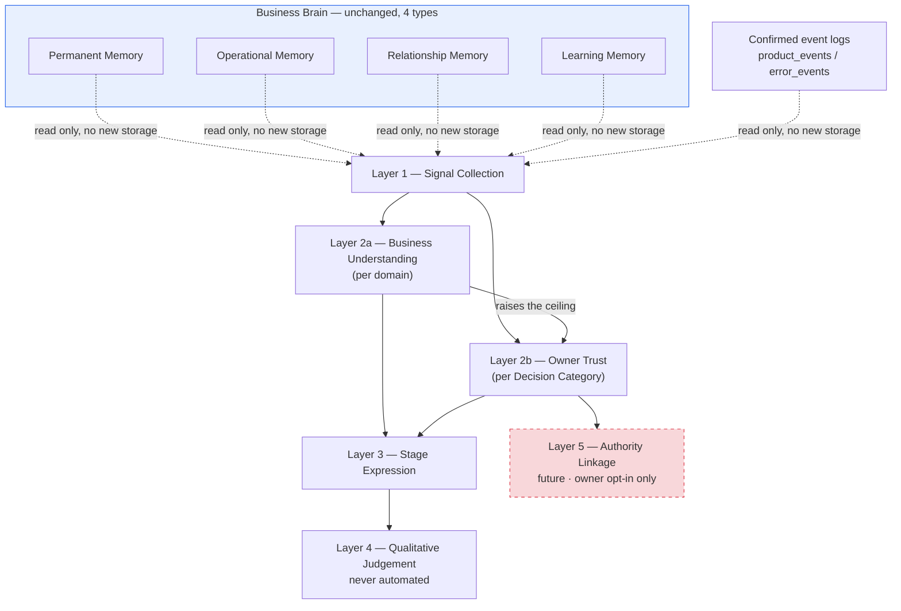

# 11 — ReplyFlow Trust Architecture

**What trust means inside ReplyFlow, how it's structured, and how it relates to everything else the Brain does.** Companion to [10-ReplyFlow-Brain-Architecture.md](10-ReplyFlow-Brain-Architecture.md) — that document maps the nine Brain Loop stages and four Business Brain memory types as they exist today; this document defines the Trust Ladder named in Handbook Ch.2 as one of the two remaining pieces (alongside Granular Authority) still designed but not built.

**Status: approved architecture, not yet implemented (2026-08-02).** This is the permanent specification for Trust inside ReplyFlow — founder-approved across three review rounds — but no code exists yet. Implementation will be planned and executed as a separate task. Until then, treat every system described below as designed, not real; check `10-ReplyFlow-Brain-Architecture.md`'s own status table for what's actually built.

**The Founder Handbook is the authority this document answers to.** Where this document and the handbook disagree, the handbook wins. Primary source chapters: Ch.00 (*"that sentence cannot be bought... it must be earned"*), Ch.02 (*"The Trust Ladder"*, *"Earned Autonomy"*), Ch.04 (the Brain Loop, the Decision Hierarchy), Ch.05 (the Business Brain, Learning Memory), Ch.06 Principle 4 (*"Trust Is Earned Before Autonomy"*), Ch.10 (Owner Authority).

---

## 1. What Trust Actually Means

Five properties, each a hard constraint on the design below — not stylistic preferences:

1. **Earned by outcomes, not accumulated by activity.** *"One correct decision at a time"* (Ch.00) — not messages sent, not uptime. Volume is not evidence.
2. **Granular, not a single score.** Ch.02: *"no two businesses should have the same ReplyFlow after a year."* A business can trust ReplyFlow completely with FAQs and never with pricing. Trust follows the same seam `lib/reply-engine/safety/decision-categories.ts` already uses, not a global number.
3. **Weighted by consequence, not just correctness.** Ch.04's Judge Risk, Ch.10's Confidence vs Consequence: a hundred correct greetings and one correct reschedule are not equal evidence.
4. **Continuously re-earned, never banked.** Ch.02: autonomy is the reward for *consistently* making good decisions — a ladder that only ever rises would eventually mean nothing. Regression must be a real, expected state, not an edge case.
5. **Felt, not read.** Ch.02 never uses a percentage — it uses stage names and a narrative arc. The owner-facing expression must stay in that vocabulary: a stage and a plain-language reason, never a stat tile.

The Handbook's own Decision Hierarchy (Ch.04) already keeps two of its ten items separate — *Owner Authority* at position 1, *Business Truth* and *Confidence* at positions 4 and 7 — which is the textual basis for §2 below.

---

## 2. Two Dimensions, Tracked Separately

### Business Understanding
*How well ReplyFlow understands this business.* Derived from memory, context, corrections, consistency, and learning — never from owner behaviour. A business can be deeply understood on day one, purely from thorough teaching, before a single customer conversation. Organised by **domain** — the same grouping `lib/brain/reasoning.ts` already uses (knowledge, receptionist, diary), extended to cover pricing and escalation specifically.

### Owner Trust
*How much responsibility the owner is willing to give ReplyFlow.* Earned through repeated successful behaviour — real approve/edit/reject history. Organised by **Decision Category** (general, booking, pricing, complaints, emergencies — the same grouping the Receptionist page's autonomy legend and Granular Authority already use). Asymmetric in one direction: **an explicit owner instruction always overrides the earned signal.** "Never book without me" pins Owner Trust at Help for that category regardless of a flawless history underneath it.

### The relationship between them
Computed and reported independently, never merged into one number. They interact in exactly one direction:

> **Business Understanding raises the ceiling. Owner Trust decides how high ReplyFlow is allowed to climb.**

ReplyFlow should never recommend more autonomy in a category it doesn't understand well, even if a small sample of early approvals looks clean. The reverse never applies — deep understanding never pressures an owner toward more trust than they've chosen to give.

This produces both of the founder's grounding examples as native states, not edge cases: a well-taught business whose owner still prefers manual review (high Understanding, low Trust — permanently valid, not a problem to solve); and an owner who trusts General completely but Pricing not at all (two ceilings, two histories, no contradiction).

---

## 3. The Five Layers

**The Trust Ladder is a derived capability, not a fifth Business Brain memory type.** The Business Brain stays at exactly four memory types (Permanent, Operational, Relationship, Learning). The Ladder reads from those four plus confirmed event logs (`product_events`, `error_events`); it stores no memory of its own.

| Layer | Question | Scope | Notes |
|---|---|---|---|
| **1 — Signal Collection** | What actually happened? | Reads the Business Brain + event logs | No new table. Business Understanding pulls from Permanent + Learning Memory; Owner Trust pulls from `product_events` and, later, Granular Authority's own settings. |
| **2a — Business Understanding** | How well is this domain known? | Per domain | Taught / partial / gap, plus consistency over time. |
| **2b — Owner Trust** | How much has been earned here? | Per Decision Category | Rolling, can rise or fall — recent approve/edit/reject history. |
| **3 — Stage Expression** | What does this look like to the owner? | Both, shown separately | Owner Trust renders as Help → Recommend → Prepare → Handle Routine Work → Operate Quietly, per category, with a plain-language reason. Business Understanding renders in the teaching pages' own existing vocabulary (known / partial / gap) — no second stage-ladder invented for it. |
| **4 — Qualitative Judgement** | What can't be counted? | Both | Owner comfort independent of the numbers; relationship-specific nuance; whether a correction was a mistake or a preference. Never automated, by design — not a future build target. |
| **5 — Authority Linkage** | What should this unlock? | Owner Trust only | Future, and strictly an offer the owner accepts — never a silent unlock. Depends on Granular Authority existing first. Business Understanding never touches this layer directly; it only ever raises what Layer 2b is allowed to climb toward. |

---

## 4. What's Measurable Now, Later, and Never

| | Today, from confirmed facts | Measurable later | Stays qualitative |
|---|---|---|---|
| **Business Understanding** | Teaching completeness — the gap/topic machinery `lib/brain/reasoning.ts` already computes | Consistency-drift detection; grounding-failure rate as a real signal | Whether the business itself is still figuring out its own answers |
| **Owner Trust** | Approve/edit/reject per category, already in `product_events` | Edit magnitude (needs a real diff/semantic-distance system); escalation-necessity; real cross-business stage thresholds (needs pilot population data) | Owner comfort independent of the numbers; relationship-specific nuance |
| **The link between them** | — | Whether Understanding reliably predicts safe Trust growth — needs real pilot evidence | Whether to actually offer more authority — always the owner's call |

---

## 5. Relationships

**→ The Brain (`lib/reply-engine/`, the 9-stage loop, Ch.04).** A new input to the existing Judge Risk / Decide stages, split correctly: Business Understanding informs *confidence* ("do I know enough here"); Owner Trust informs *authority* ("am I allowed to act on it"). Mirrors the Decision Hierarchy's own separation of Business Truth from Owner Authority. The Brain Loop's shape doesn't change — only what it's permitted to ask.

**→ The Business Brain (`lib/brain/`, Ch.05).** A reader, never a fifth member. Business Understanding is substantially a re-expression of Permanent + Learning Memory; Owner Trust reads Relationship + Operational history. The four-memory model stays exactly as documented in `10-ReplyFlow-Brain-Architecture.md`.

**→ Learning Memory.** Business Understanding's primary source, and the most direct dependency in this design — a business becomes better understood specifically because Learning Memory accumulates corrections and settles them. Learning Memory is not built yet (see doc 10); Business Understanding's fuller form depends on it.

**→ Adaptation.** Adaptation changes behaviour; neither Trust dimension does that alone. Business Understanding crossing a threshold means Adaptation now has enough to work with; Owner Trust crossing a threshold means Adaptation is now permitted to act on it.

**→ Authority (Granular Authority, doc 10's other "designed but not built" item).** Owner Trust's only real counterpart. Business Understanding never touches Authority directly — it only raises what Owner Trust may be offered. Layer 5 depends on Granular Authority existing first.

**→ The Receptionist.** Both dimensions record receptionist behaviour; neither changes it. The natural home for showing both, separately, once built, is where the Receptionist page's `AUTONOMY_ROWS` legend already lives — two adjacent readings, never merged into one line.

---

## 6. Minimal V1 (planned, not yet built)

Scoped for when implementation is picked up as its own task — recorded here so the shape is decided ahead of time, not invented mid-build:

- **Business Understanding V1** may need no new computation — substantially a relabelling of the gap/topic system the teaching pages already compute, surfaced under this architecture's name.
- **Owner Trust V1** reads `product_events` (`draft.approved` / `draft.edited` / `draft.rejected`) exactly as it exists today. Scoped to the five owner-facing categories already on screen, a rolling recent window, rendered as a stage label with a plain-language reason. "Not enough history yet" is a valid, expected state.
- Both read-only. Neither changes any toggle, any auto-send behaviour, or any escalation rule. Layer 5 stays out of scope until Granular Authority exists and has real pilot evidence behind it.

---

## Keeping this document honest

This is the permanent specification, not a living implementation log — when Trust Ladder V1 actually gets built, update `10-ReplyFlow-Brain-Architecture.md`'s own status tables (the "designed but not built" section, and the Business Brain memory table's Learning row) to point here and mark what's real. If a future implementation finds this architecture doesn't hold — a case Layer 2's ceiling relationship doesn't handle cleanly, say — correct this document in the same commit rather than letting code and specification quietly drift apart. That drift is exactly what `10-ReplyFlow-Brain-Architecture.md` was written to prevent for the Brain Loop; the same discipline applies here.
